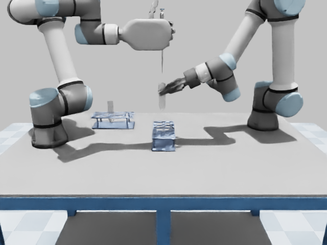
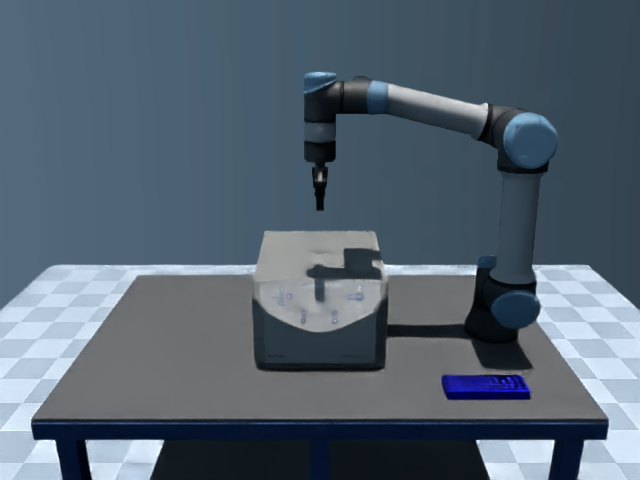

# Hooke

**A simulation platform for robotic laboratory automation.**

Hooke brings robots, laboratory instruments and experiment tasks into one
workspace. Browse scenes in a web interface, run scripted experiments, inspect
recorded results and generate demonstrations for robot learning.

## What you can do

- **Explore laboratory scenes:** choose tasks, instruments, robot placements
  and available asset variants.
- **Run experiment tasks:** perform pipetting, tube handling, centrifuge
  operation, vortex mixing and other instrument interactions.
- **Inspect results:** view camera images, replay recorded runs and check task
  outcomes.
- **Build learning datasets:** export successful demonstrations with images,
  robot states, actions and language instructions for policy training.

## Experiment scenes

Actual simulation images from three laboratory tasks.

| Pipetting | Centrifugation | Vortex mixing |
| --- | --- | --- |
|  |  |  |

## Quick start

### 1. Install

The current simulator environment uses Linux x86_64, Python 3.12 and MuJoCo
3.3.0. Browser previews and rendered runs require an NVIDIA GPU with EGL
support. The bundled native components need a compatible system environment;
see the [setup and troubleshooting guide](docs/isaac_operations.md).

```bash
git clone https://github.com/RobotEurekaLab/Hooke.git
cd Hooke

conda create -n hooke python=3.12 -y
conda activate hooke
pip install 'mujoco==3.3.0' numpy scipy 'jax[cpu]' toppra trimesh \
  shapely triangle manifold3d sympy zstandard tqdm networkx usd-core \
  'imageio[ffmpeg]' matplotlib scikit-image pillow flask msgpack websockets
```

Isaac Sim 4.5 is an optional runtime for supported tasks. Follow the
[runtime configuration guide](docs/isaac_operations.md) before selecting it
in the interface.

### 2. Start the interface

Run from the simulator directory so its native plugins resolve correctly:

```bash
cd Hooke
export MUJOCO_GL=egl
export HOOKE_ISAAC_GPU=0
python -m webui.server --host 0.0.0.0 --port 8080
```

Set `HOOKE_ISAAC_GPU` to an available GPU index; the interface also uses this
setting for scene rendering.

Open `http://localhost:8080/` on the same machine. For a server, open
`http://<server-ip>:8080/` from another device on the same network.

### 3. Run an experiment

1. On the home page, choose a category and task to preview its scene. Robot
   replacement in this picker is a scene preview; it does not adapt the task's
   controller.
2. Open `http://<server-ip>:8080/backends` to run a task. Select the task and
   random seed, then click **运行原任务** (Run task) in the simulator's panel.
3. Inspect camera frames and progress during the run, then review the recorded
   result and replay.

The command-line interface is also available. From the same simulator
directory, run a pipetting task without rendering:

```bash
python -m backends.run --task pipette_transfer --backend mujoco \
  --mode expert --seed 0 --no-render --output ../temp/pipette-example
```

Use a new output directory for each run. Results include `result.json`,
`trajectory.npz` and task logs; rendered runs also save camera frames.

## Generate demonstrations

Export demonstrations for a single-arm task from the simulator directory:

```bash
python -m archetypes.demo_export close_fume_hood --num_seeds 10
```

Successful episodes are saved under `Hooke/logs/demos/close_fume_hood/` as
`.npz` files containing camera images, robot states, actions and a task prompt.
The [LeRobot conversion script](openpi/examples/hooke/convert_hooke_demos_to_lerobot.py)
prepares these files for the [policy training workflow](openpi/README.md).
Use a separate training environment for OpenPI.

## Documentation

- [Simulator reference](Hooke/README.md): task files, assets and trajectory rendering.
- [Configuration and troubleshooting](docs/isaac_operations.md): runtime setup,
  rendering options and recovery.
- [Pipetting task](docs/isaac_pipette_transfer.md) and
  [centrifuge cycle](docs/isaac_centrifuge_cycle.md): task behavior and recorded results.
- [Validation and current limitations](docs/isaac_completion_plan.md): supported
  behavior and experimental scope.
- [Policy training and inference](openpi/README.md).

## Repository layout

| Directory | Contents |
| --- | --- |
| `Hooke/` | Simulator, experiment tasks, assets and web interface |
| `openpi/` | Policy training and inference, including pi0.5 configurations |
| `openpi-pi0-legacy/` | Earlier pi0 training setup |
| `RoboticsDiffusionTransformer/` | RDT baseline |
| `docs/` | User guides and validation summaries |

Generated screenshots, videos and raw experiment records belong in the ignored
`temp/` directory. Simulator logs and demonstrations use `Hooke/logs/`, which
is also ignored.

## Acknowledgements and license

Hooke builds on [AutoBio](https://arxiv.org/abs/2505.14030),
[OpenPI](https://github.com/Physical-Intelligence/openpi) and
[Robotics Diffusion Transformer](https://github.com/thu-ml/RoboticsDiffusionTransformer).

Hooke is licensed under [MIT](LICENSE). Third-party code and assets retain
their accompanying licenses and attribution notices.
