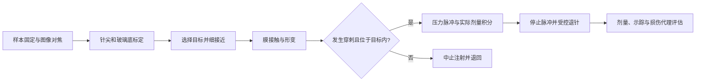

# 细胞微注射：工具、流程与接入方案

Current cell display uses estimated grayscale phase contrast and a separate
fluorescence channel. See [cell imaging](microscopy_imaging.md) for the image
formation model, nominal dimensions and calibration limits. Earlier image
records below retain their original renderer and settings.

调研日期：2026-09-18。本文给出工具、流程与完整设计。后续已实现 **`microscopy_cell_injection` 第一版贴壁细胞 phantom**，包含简化膜形变与阈值穿刺、胞质注液、退针和合成示踪；双侧吸持另有独立的[悬浮细胞任务](suction_microinjection.md)。两者均未经过生物标定。原 `microscopy_injection` 保持开放微腔注液。运行及证据见 [显微平台 demo](microscopy_demo.md)，持续工作见 [goal 验收](microscopy_goal.md)。

## 1. 先选择样本与固定方式

| 配置 | 固定方式与末端 | 建议用途 |
| --- | --- | --- |
| 贴壁单细胞 | 玻璃底培养皿上的贴壁细胞；一支空心玻璃注射针 | 第一项任务，先完成针尖定位、形变、穿刺、剂量与退针 |
| 双侧悬浮大细胞 | 左侧吸持管与独立负压通道；右侧注射针与正压通道 | 第二项任务，增加吸持建立、失稳、双针干涉与释放 |

贴壁细胞工作站通常使用倒置镜，针具由侧面进入开放培养皿；玻璃底位于样本下方。厂商指南同时强调减振、针尖对焦和进针高度限制。这个配置可沿用现有倒置镜布局。[Eppendorf 贴壁细胞微注射指南](https://www.eppendorf.com/product-media/doc/en/825836/Cell-Technology_Protocol_047_InjectMan-4-FemtoJet-4_Step-Step-Guide-Microinjection-Adherent-Cells-Eppendorf-InjectMan-4-FemtoJet-4.pdf)

吸持与注射是不同通道。Narishige 的官方配置说明吸持侧通过微吸管施加吸力；其 IM-11-2 支持吸取与注入。这个型号的手动压力旋钮只用于理解管路，项目中的位置轴和压力程序仍采用电动控制。[Narishige 吸持说明](https://news.narishige-group.com/pdf/news055en.pdf)、[IM-11-2 官方资料](https://products.narishige-group.com/group1/IM-11-2/injection/english.html)

双侧注射不自动等同于 ICSI。第一版演示使用模拟细胞与示踪液，暂不包含生殖操作或生物反应机制。

## 2. 要补齐的资产

| 模块 | 几何与接口 | 行为 |
| --- | --- | --- |
| 培养皿与样本 | 开放低壁玻璃底皿、液面、细胞膜、胞质、细胞核 | 贴附或吸持、膜形变、示踪剂分布 |
| 电动注射微操 | XYZ 精细移动、可调倾角持架、针尖坐标与轴向方向 | 粗接近、细进针、限定深度、沿原路径退针 |
| 空心玻璃针 | 分别记录内外径、锥度、开口、伸出长度；接到压力管路 | 流阻、堵塞、注射、针尖触底风险 |
| 双侧吸持附件 | 圆钝吸持管、左侧电动 XYZ、独立压力管路 | 负压固定、吸持形变、失去吸持、释放 |
| 电控压力组件 | 补偿压力、注射脉冲、阀状态与实际压力 | 稳态背景流、有限脉冲、液体转移及泄漏记录 |
| 显微成像 | 校准像素尺寸、焦点、针尖与样本高度、明场/示踪显示 | 图像选点、对焦、剂量观察；总览与局部使用共同时间 |

厂商指南给出的细胞注射针开口示例为亚微米量级，并分别定义补偿压力、注射压力和脉冲时长。补偿压力用于降低回吸风险，**不是吸持管的负压**；指南也要求按样本与针具调整设置。不能直接沿用现有 20 µm 等效内半径与 100 nL 微腔剂量。[Eppendorf 指南，工作站与针具部分](https://www.eppendorf.com/product-media/doc/en/825836/Cell-Technology_Protocol_047_InjectMan-4-FemtoJet-4_Step-Step-Guide-Microinjection-Adherent-Cells-Eppendorf-InjectMan-4-FemtoJet-4.pdf)

细胞注射剂量应通过针具、压力与时间标定。已有定量微注射研究使用液滴体积变化和荧光观测核查注射量，说明“设定压力”本身不足以证明实际剂量准确。建议先以液滴或人工细胞做标定任务，再进入细胞任务。[Chow 等，Scientific Reports 2016](https://www.nature.com/articles/srep24127)

### 当前演示的针具尺寸

注射针尖外径 1.2 µm、内径 0.5 µm，针与 holder 共轴、与水平夹角 35°；吸持侧夹角 30°。针尖后 100／300 µm 处外径为 2／4 µm，随后过渡至 1 mm 后端玻璃管身。空心网格、合成显微轮廓和流阻共用 `microscopy/pipettes.py` 中的米制分段轮廓。流阻逐段积分 `8µ/π ∫ ds/r(s)^4` 并串联；压力、剂量和响应参数仍未经过实测标定。

Eppendorf 官方说明中的 Femtotips 内开口为 0.5 ± 0.2 µm；Sutter 拉针指南强调细尖后的渐变轮廓。这里的各段长度和轮廓是独立估算，不能据此宣称复制了它们的成品针。[Femtotips 官方说明](https://www.eppendorf.com/product-media/doc/en/139747_Supplement-sheet/Eppendorf_Consumables_Instructions-use_Femtotips_Femtotip-II.pdf)、[Sutter Pipette Cookbook](https://www.sutter.com/hubfs/WEB%20-%20PDF%20Files/cookbook.pdf)

## 3. 可以复用的开源控制参考

找到并实际检查 [Biosensing and Biorobotics Lab 的 Autoinjector](https://github.com/bsbrl/autoinjector)。本地研究副本位于忽略目录 `temp/microscopy_research/autoinjector/`，固定提交为 `2da3b843fabf3f0615eb8d8a495ee2611f3acf81`，分支 `PVCAM`。

| 检查对象 | 可借鉴的内容 | 接入限制 |
| --- | --- | --- |
| `motorcontrol/trajectorythread_minimal.py` | 图像平面到微操轴的变换；多点接近、进针与退回的轨迹组织 | 包含硬编码角度、单位说明不一致、宽泛异常捕获；须独立标定并重构 |
| `motorcontrol/altermotorposition.py` | 电动微操位置查询、相对/绝对位置指令与完成检查 | 依赖实机 Sensapex 接口与固定设备编号 |
| `pythonarduino/injectioncontrolmod.py` | 区分背景压力与注射触发；压力、脉冲和次数参数 | 输出硬件电压/串口指令，不是压力流量模型；不能直接作为模拟剂量 |
| README 与 `LISENCE.txt` | 原始系统需求与 MIT 许可核查 | Python 2、PyQt4、Windows 与实机相机依赖；未安装或运行此旧程序 |

代码确实具有 [MIT 许可](https://github.com/bsbrl/autoinjector/blob/2da3b843fabf3f0615eb8d8a495ee2611f3acf81/LISENCE.txt)。若后续复制或改编其中代码，需要保留原版权与许可。当前只做研究核查，尚未复制到运行模块。设备 SDK、厂商 CAD 和第三方组件的权限须分别确认，不能由该代码的 MIT 许可推导。

其配套论文研究的是组织内单细胞图像引导注射，适合参考相机、操手与压力控制的协作。**它没有提供可直接接入 Hooke 的细胞穿刺物理模型或整机三维资产**。[Autoinjector 原论文，2019](https://pmc.ncbi.nlm.nih.gov/articles/PMC6776899/)

## 4. 第一版任务流程

下面是根据上述资料和本仓库结构提出的实现方案。

视觉应同时展示培养皿内的细胞阵列、针尖近景、膜压凹、进入胞质后的示踪亮度变化与退针。图像变化必须来自模型状态；不能用预录动画代替闭环执行。允许背景补偿流时，针尖在细胞外的液体应进入环境账本，不能记为细胞内剂量。

第一版先限定胞质注射；细胞核可以展示与避障。核内注射还需核膜与另一层穿刺判据，应另设任务，不能只换目标标签。

## 5. 物理与代码分工

建议保留现有整机、电动关节和真实编码器，将微尺度样本模型解耦：

- **工作站与工具运动：** MuJoCo/PhysX 提供实际针尖位置、速度和模拟时间。
- **细胞力学：** 独立的膜黏弹响应、接触力、损伤与穿刺状态；反作用力应施加到工具，模型参数和力方向单独记录。
- **压力与液体：** 针具流阻、阀与压力响应、细胞背压；对供液、胞质、外泄和环境做守恒账本。
- **成像与评估：** 根据膜形状、针尖深度、示踪状态与焦点生成图像；控制器读图像和编码器，真值仅用于成像与验收。

文献中的 DPD 模型包含膜网络与细胞骨架，并验证黏弹响应及速度相关的注射形变。这说明把样本替换成刚体球不足以复现细胞穿刺。该论文也明确自身模型的现象学限制；不能把其参数直接套用到任意细胞。[细胞膜与骨架力学模拟，2024](https://pmc.ncbi.nlm.nih.gov/articles/PMC11052030/)

第一阶段可实现参数明确的简化黏弹膜和阈值穿刺模型，标为**未生物标定的演示模型**；第二阶段再考虑膜网格/专用软体求解器和实验力—位移数据标定。两阶段不能混用完成度指标。目前没有已验证的原生 Isaac 细胞软体桥接。

微尺度处理也要独立设计：当前 1.2 mm 微珠与 14 mm 视场无法直接满足单细胞成像。需更窄视场与一致的长度、质量、力、压力、体积换算，检查求解器容差、时间步及惯量下限。不要通过增大细胞质量或隐式焊接掩盖不稳定。

## 6. 验收顺序

1. **液滴/人工细胞标定：** 测量像素尺度、针尖高度、压力—流量与实际剂量，确认质量/体积守恒。
2. **贴壁胞质注射：** 对焦、膜接触、形变、穿刺、注液、退针均有独立记录；图像目标、针尖深度、力峰值和胞内体积可检查。
3. **双侧吸持注射：** 增加固定建立、吸持失效、两支针/皿壁/聚光器干涉及最终释放。
4. **双后端回归：** 用各引擎的实际工具状态执行，分别报告成功率、力与剂量；相同程序不等于物理等价。

必要的失败对照包括：无动作、未穿刺施压、针尖在细胞外、针堵塞、进针过深、目标移动/失去吸持，以及退针不完整。未穿刺情况下胞内转移应为零；关闭注射脉冲、外泄与残余背景流都应如实入账。

可报告膜损伤代理量，不能据此宣称真实细胞存活、膜自行恢复或生物实验成功。平台第一版的验收目标是可观察、可控制、可核查的注射流程。

## 7. 已实现的逐对象离焦

细胞显微图使用独立光学层：每个细胞按自身高度与当前焦平面的距离计算 Gaussian 离焦，其胞质、细胞核与示踪信号一起变模糊。当前贴壁和悬浮模型分别声明初始参考高度 4 µm 与 26 µm；移动调焦轴会改变焦平面，细胞轴向运动会改变其离焦量。吸持管与注射针另按各自针尖高度合成，控制器使用的原始图像不包含穿刺或吸持判定标记。旧 `recordings_depth` 等阶段记录的贴壁参考高度仍为 7 µm，保留其原配置；新 8 µm 厚度的结果独立归档为 `paper_scale_v1`。

四项测试验证轴向移位会离焦、相同焦点位移可恢复图像、同图不同高度的细胞可分别对焦，以及针尖拥有独立离焦。渲染测试不推进模拟时间、不移动器械，也不改变体积账本。贴壁与双侧注射的 14 项流程/失败对照测试通过；新版五项 MuJoCo CAD 录像在 `temp/microscopy_demo/cad_integration/recordings_depth/`。

这仍是合成图像近似：一个细胞作为中心高度的光学层，整支毛细管近似为针尖高度的单层；没有沿管长积分、三维点扩散函数、折射率、真实相差或荧光定量。极远离焦的层（模糊标准差超过画幅的四分之一）被省略。像素标尺、锐度和示踪颜色不能当作实机光学标定。

## 8. 完全相同光学层的有界复用

[光学缓存](../Hooke/microscopy/optical_cache.py)只复用完整输入字节、形状、类型及卷积参数相同的结果，不量化位置、焦点或强度，也不缓存工具叠加、状态标记或时间文字。每台显微镜独立持有缓存，输入与结果数据合计最多 64 MiB、最多 16 项；超限对象直接计算，缓存结果只读。

三项检查覆盖输入原地改变、焦点/边界参数变化、内存与项数限制，以及完整细胞图在针位、部分剂量、焦点和细胞高度改变时与无缓存计算逐像素一致。逐对象离焦四项、贴壁七项和吸持八项流程回归通过；新 CAD 配置的两项完整 MuJoCo 演示及缓存版原生吸持注射也通过。实际输出在 `recordings_cached_cells/` 与 `native_cached_suction/`。

同机独立测量中，稳定对象层重复渲染由约 1.55–1.62 s 降至 0.53–0.57 s，约提速 2.9 倍，8-bit 图像像素差为零。首次测得缓存计算 2.48 s、无缓存 1.93 s；首次构建与图层变化会增加开销，不能将稳定层的提速扩展为所有帧或实时帧率保证。数据见私有 `plane-cache-integrated-benchmark.json`，含首次与重复测量、命中次数和实际保留数据量。
