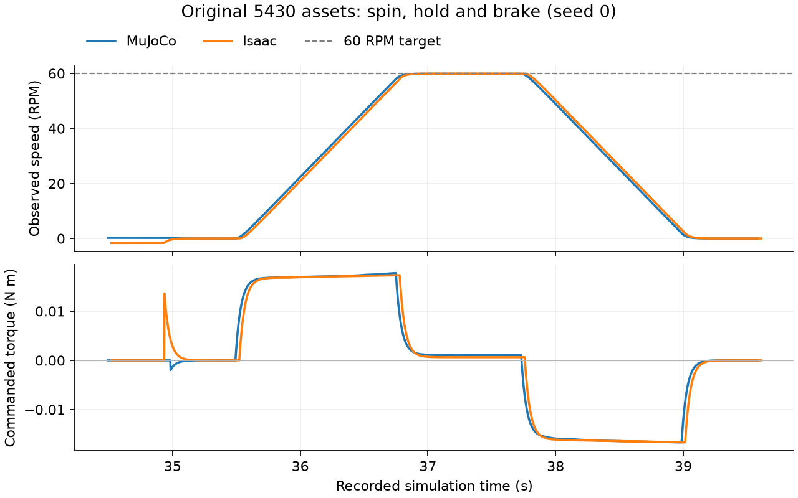
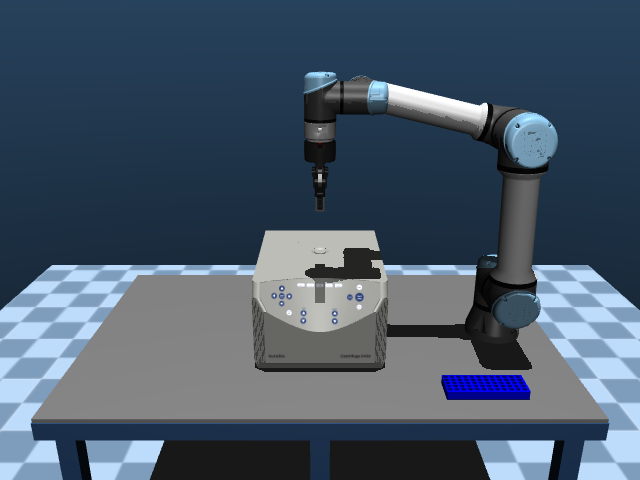

# 完整离心流程与独立验收

`centrifuge_5430_cycle` 在同一次重置后完成插管、关盖锁盖、转子停稳、旋转计时、制动与安全解锁。网页 `/backends` 可选择该任务并依次运行两个后端。目录现有 167 项。

## 机械实现

复用原 5430 机器人、试管、转子、盖板、碰撞网格和相机，新增有界转矩电机及两个样品固定约束。固定机构在实际测得的就位姿态建立相对约束，没有把自由物体写入目标位姿。MuJoCo 使用柔顺 weld，PhysX 使用固定关节；两者的柔顺响应尚未标定为等价。

默认程序为 60 RPM、连续保持至少 1 秒、转矩不超过 0.1 N·m。启动要求盖板关闭、锁盖生效、负载配平且转子停稳。失去盖板、锁盖或配平条件时进入制动；解锁要求实际速度低于 0.02 rad/s 且持续停稳至少 500 ms。连续计时中断会清零，完成后重新运动也会清除旧停稳时间。

完整流程声明 60 秒仿真时限，原插管和关盖的原子任务时限分别保留。程序是机械控制验证，未模拟或标定高速离心分离、样品浓度场或真实设备参数。

## 独立验收

控制器状态之外，观察器逐步检查九项实际证据：两管先就位、结束时保持就位、真实旋转超过一圈、目标转速连续保持、停稳 500 ms、配平误差不超过 5%、盖板关闭、停稳后解锁、运动时无联锁违规。任务谓词、观察器和声明时限同时通过才算专家通过。

MuJoCo 与 Isaac 最终冻结版本 `3080443` 的十种子专家均为 10/10，各十个 60 秒空动作对照均误通过 0/10。MuJoCo 专家仿真时长 39.582–40.442 秒；Isaac 为 39.610–40.448 秒，实际耗时 477.646–547.472 秒。二十对专家和对照的源输入及实际资产比较通过。此前 `cd2a861` 的原生试验回合保留其仿真 39.61 秒、实际耗时 604.501 秒的独立结果。

最终版本的 Isaac 首个回合也已通过，实际耗时 547.472 秒。其 19,805 步完整控制、位置、速度、时间与接触数组和此前原生试验逐字段及类型相等，源数值字段、规范化 XML 与实际资产也相等；[对照记录](validation/isaac_cycle_runtime_compatibility.json)。两次耗时不作为受控性能加速结论。



[可编辑曲线 SVG](assets/centrifuge-cycle-speed-torque.svg) 与 [实际轨迹来源及哈希](validation/isaac_cycle_motion_plot.json)。曲线读取各引擎真实回合的关节速度和控制量，没有增加回放或新的成功回合。

[逐回合报告](validation/isaac_centrifuge_cycle_summary.json) 保存实际批次版本、输入指纹、请求分母、时限、事件和资产对照。旧 [仅插管、关盖、锁盖协议](isaac_centrifuge_chain.md) 保留其当时结果，不改写为已执行旋转。

## 实际画面

[局域网完整离心对照](http://10.5.174.93:8081/cycle-gallery.html) 展示两个原相机、四个实际阶段，共 16 张原资产图片。解锁只解除约束，盖板保持关闭。各引擎恢复其真实成功回合状态，回放不增加专家通过数。

| MuJoCo：程序制动结束 | Isaac：程序制动结束 |
| --- | --- |
|  |  |

原生回放独立记录 Kit 内部初始化 2 个 PhysX 事件，随后恢复记录状态；各次渲染实际推进 0 个物理事件，最大状态刷新 FK 偏差小于 0.33 µm。[MuJoCo 图片及哈希](validation/isaac_cycle_mujoco_keyframes.json)、[Isaac 图片、事件计数及哈希](validation/isaac_cycle_isaac_keyframes.json)。

## 运行

从源码 `Hooke/` 目录使用已配置的环境：

```bash
../.venv/bin/python -m backends.matrix --task centrifuge_5430_cycle \
  --backend isaac --mode expert --mode no_action \
  --seeds 0 1 2 3 4 5 6 7 8 9 --control-seconds 60 \
  --wall-seconds 1800 --gpu 6 --output ../temp/cycle-acceptance
```

将 `--backend` 改为 `mujoco` 可运行原引擎。每次使用新目录，恢复同一批次才加 `--resume`。日志、轨迹、源模型和真实图片保存在服务器；Git 保存精简结果和图片。

`parity_qualified=false`、`scientific_process_validated=false` 保留。功能通过不代表高速物理、像素或实时性能等价。
