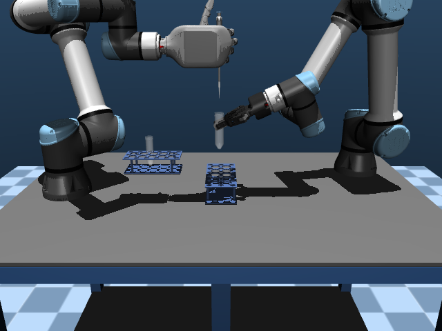

# 完整双容器移液与共享任务判定

当前完整移液专家的任务谓词、独立操作、时限和理想体积验收均为 MuJoCo 10/10、Isaac 10/10；两引擎各十个 45 秒空动作对照的动作及体积误通过均为 0/10。共 40 个实际回合、20 对源模型与实际资产对照通过，见 [十种子报告](validation/isaac_pipette_transfer_ten_seed_summary.json)。[完整离心流程](isaac_centrifuge_cycle.md)、[简化科学模型](validation/isaac_science_model_summary.json) 和 [改进后的真实画面对照](isaac_visual_configuration.md) 单独报告。

下文保留此前五种子验收的版本、指标和失败历史，其“尚未完成”“下一阶段”等描述指当时状态。

## 历史五种子验收结果

2026-09-17，完整移液运行代码冻结于 `5193ed3`，每个批次使用独立目录。新增目录入口 `pipette_transfer`；原 `pipette` 继续表示吸液和抬起。两者分别声明 45 秒和 30 秒时限。

| 完整移液 | MuJoCo | Isaac |
| --- | ---: | ---: |
| 专家任务谓词 / 操作 / 时限内 / 理想体积 v3 | 10/10 / 10/10 / 10/10 / 10/10 | 5/5 / 5/5 / 5/5 / 5/5 |
| 专家种子 | 0–9 | 0、1、4、6、8 |
| 45 秒空动作对照误通过 | 0/10 | 0/1 |

新的 Isaac 实际运动回合只按上表记录数统计，离线重放不计入原生验收。一次启动尝试被 GPU 占用检查拦住，物理步数为 0；这不说明修正成功或失败。上述五个专家及一个空动作回合实际完成，尚未完成原生十种子验收。已完成的原生回合与对应 MuJoCo 源数值字段、名称、规范化 XML、资产清单和实际资产文件 SHA-256 对照共 6 对；未执行回合不声明资产对照通过。

| 专家回合指标 | MuJoCo，10 个种子 | Isaac，5 个实际运动回合 |
| --- | ---: | ---: |
| 仿真时长（秒） | 31.55–34.142 | 31.532–34.14 |
| 完整回合实际耗时（秒） | 52.4333–114.877 | 446.904–498.945 |
| 目标容器终量（µL） | 200–200 | 200–200 |
| 吸头终量（nL） | 0–5.81094e-11 | 0–0 |
| 环境终量（nL） | 0–0 | 0–2.11965e-11 |
| 最大液面几何体积误差（nL） | 0.999606–0.999984 | 0.999851–0.999988 |
| 最大总体积误差（m³） | 1.35525e-20–6.77626e-20 | 2.71051e-20–8.13152e-20 |
| 源试管归位误差（mm） | 0.963945–1.0704 | 1.16571–1.59499 |
| 目标试管位移（mm） | 0.97636–1.02856 | 0.112302–0.112302 |

[完整逐回合指标、失败候选与哈希](validation/isaac_pipette_transfer_summary.json) 随分支保存。旧的 [190 回合共享流程基线](validation/isaac_shared_processes_summary.json) 保留其当时的版本和结果，未覆盖为本次成功记录。

## 真实画面对比

历史采集的 18 张真实关键帧覆盖种子 0 的吸液完成、排液完成、源试管归位及三个原始相机。仓库仅保留吸液完成的前视示例，其余过程截图保存在本地忽略目录。各引擎恢复其实际记录的关节状态与两个液面后出图。旧报告只观察到运行器回合计数为零，不能证明 Kit 内部初始化没有物理步骤；本轮独立 PhysX 回调发现初始化含内部步骤，随后恢复源状态。新离心关键帧实际记录初始化 2 步、恢复后渲染推进 0 个物理事件。相同阶段可能有不同记录时间，图像回放不计为新增闭环回合。

| 实际阶段，前视 | MuJoCo | Isaac |
| --- | --- | --- |
| 吸液完成 |  |  |

[图片、实际轨迹、液面及渲染审计哈希](validation/isaac_pipette_transfer_keyframes.json)。光照、玻璃和材质响应仍有差异，未声明像素等价。

桌面与 480 px 手机宽度的真实浏览器检查通过：三个相机的 18 张图片全部加载，无横向溢出或 JavaScript 错误，未启动额外仿真回合。[浏览器检查记录](validation/isaac_pipette_transfer_browser.json)。

## 实现与判定

`PipetteRecipe` 共享机械臂运动和实际拇指操作。完整任务复用原吸头、50 mL 试管、UR5e 机械臂和同款试管架资产：抬起源试管、吸入 200 µL、携液移动、下降至空目标试管内、按下按钮排液、保持按钮按下退出、在空气中释放、放回并松开源试管。运行期间只发送执行器控制；自由物体摆放仅发生在重置阶段。

`ProcessProgressSystem` 位于仪器、液体和协调器更新之后。任务谓词及独立回合验收各自持有观察器，使用同一份 `ProcessProgress` 规则；读取检查或报告不修改过程历史。新增目标体积按目标容器相对于重置初值的净增量计算，源与目标液面均独立反算几何体积。

完整任务要求有序吸液、转移、排液、退出；目标净接收量距 200 µL 不超过 5%，吸头残量及环境储量各不超过 1 nL。源试管需放回 5 mm 内、轴向倾角小于 5°、脱离机器人，并持续稳定 500 ms，稳定锚点允许位移 0.5 mm；目标试管位移小于 5 mm、倾角小于 5°。理想体积验收另外要求全储量守恒、容量边界及每个容器的液面几何误差不超过 1 nL。

原吸液与涡旋的状态规则 AST 与原 `hooke-manipulation-v3` 完全相等。此次操作验收版本为 `hooke-manipulation-v4`；完整移液体积为 `hooke-ideal-volume-v3`，原吸液仍使用 v2。涡旋在随机摆放完成后重新建立观察锚点，修正任务判定与独立验收的重置顺序差异。

当前冻结版本再次执行原吸液种子 0 和涡旋种子 0、4，专家及空动作共六条 MuJoCo 轨迹，控制、位置、速度、时间与旧版本逐字段及类型相等；专家任务谓词和独立操作验收均通过。完整移液十种子的专家和空动作另外 20 条物理轨迹与独立架原方案逐字段及类型相等。未重新运行采用新谓词的默认 Isaac 涡旋，旧默认种子 0 的操作证据属于历史记录。

端点修正后的 Isaac 种子 1 与修正前实际失败回合的控制、位置、速度、时间和接触数组完全相等，轨迹压缩文件 SHA-256 也相等。改变的是理想模型的柱塞端点输入映射，未通过修改物理轨迹取得体积成功。

## 失败与修正记录

1. 同架接收方案：MuJoCo 十个专家中 6/10 通过；部分种子的实际接收试管发生倾斜。种子 1 从 3.008 秒开始倾斜，该 MuJoCo 记录状态重算接触时发现持管臂的左侧随动指与接收试管接触，支持夹爪碰撞的解释。独立接收架复用原架资产，两个失败种子复测通过，随后十种子回归全部通过。
2. 独立架原生种子 1：动作和归位完成，但环境累计排液 1.271496 nL，超过原 1 nL 阈值，保留失败。实际正向按钮行程在携液转移及下降阶段分别累计 0.542542 nL、0.713755 nL；空吸头阶段的按钮行程不解释为泄漏。
3. `ea404e7` 降低携液移动和下降的速度后，原生种子 1 环境损失反而为 1.810837 nL，仍失败。低速没有修正输入端点波动，当前版本复用既有速度 0.5、加速度 0.5 的温和规划器，删除额外低速规划器。
4. `5193ed3` 在两引擎共用的柱塞输入转换中声明 10 nm 端点容差。8 mm 行程和 200 µL 容量对应 0.25 nL 的端点体积尺度。仅端点邻域映射至释放/压下状态，中间行程逐位移保留；关节原值、原始归一化值、容差及映射后的值都可审计，未修改 PhysX 状态或体积验收阈值。
5. 两个失败回合使用记录位姿和原液面边界离线重放，零容差完整复现环境损失；10 nm 容差后环境量分别为约 1.003e-11 nL 和 0 nL。该反事实重放支持输入累加原因，但不计为修正后的原生成功回合。单元测试另外证明逐步压动 60 nm 仍记录 1.5 nL 环境损失并判为失败。

10 nm 是此理想模型声明的数值容差，未标定为真实移液器的物理分辨率，也不证明微小柱塞位移不会在现实中排液。[PhysX 文档](https://nvidia-omniverse.github.io/PhysX/physx/5.4.0/docs/Joints.html) 说明硬限位默认在边界停止，软限位采用弹簧恢复；本模型中 MuJoCo 软限位释放态与 PhysX 硬限位释放态不同。上述端点波动原因属于记录和重放支持的推断。

## 离心机诊断与后续工作

连续插管再关盖的 MuJoCo 诊断覆盖种子 0、4，每个回合仅重置一次，实际运行现有两段机械臂配方。插管完成后，关盖末态距锁盖目标约 1.734 rad，锁盖未激活；未运行旋转。旧关盖检查恒真会误报成功，此次 `59984f3` 将 5430、5910 和复合关盖步骤改为同时检查实际盖板角度及锁盖状态。

`58755b9` 将盖板动作提取为共享配方，并在连续插管后通过执行器回到关盖接近姿态。新 45 秒连续协议的实际插管、关盖和锁盖结果见 [离心机连续操作验证](isaac_centrifuge_chain.md)。该协议仅重置一次，未改变原子任务的 15 秒时限；关盖前的接近运动计入协议耗时。5430、5910 各三个种子的独立关盖回归，共六条完整物理轨迹、源模型与资产均与提取前完全相等。

完整离心链尚未完成。下一阶段添加转子驱动、启停输入、配平检查、减速结束及锁盖联动。原 5430 资产的执行器块为空，插管和锁盖成功不代表已有旋转功能。

84 项单元测试通过。历史离心机状态夹具在本次修改前后均有相同的既有差异：5430 种子 0 最大 qpos 差 2.858623e-5，时间相等；该历史夹具检查未通过。此次盖板判定修改前后重新运行的物理终态位置、速度、时间逐字段及类型相等，未把更新夹具当作修正物理行为。

## 范围

本模型是实际按钮运动驱动的理想体积记账，未模拟压力、气体压缩性、气泡、滴落、真实残液或流量标定；液量未反馈到容器质量和惯性。还未补齐通用热学、流体模型或任意 MJCF 特性支持。

`parity_qualified=false`、`scientific_process_validated=false` 保留。功能回合成功及资产一致不代表真实移液精度、动力学、像素或两引擎性能等价。

## 提交署名与复现版本

本仓库使用 universea 推送及提交身份，22 条已发布提交和 6 条本地提交完成仅署名改写。证据保留实际执行时的原哈希，不改成未执行过的新哈希；[原哈希、等价新提交与相同源树映射](validation/isaac_commit_identity_mapping.json) 用于从当前分支定位相同代码。原始 77e0ebb 及此前贡献者提交未修改。新运行冻结版本 5193ed3 已使用正确身份。

## 复测

从源码 `Hooke/` 目录使用已配置的 Python，每次使用新输出目录：

```bash
python -m unittest discover -s ../tests -v
python -m backends.matrix --task pipette_transfer --backend mujoco \
  --seeds 0 1 2 3 4 5 6 7 8 9 --mode expert --mode no_action \
  --control-seconds 45 --output ../temp/backend_parity/transfer_recheck_source
python -m backends.matrix --task pipette_transfer --backend isaac \
  --seeds 0 1 4 6 8 --mode expert --wall-seconds 900 --gpu 6 \
  --output ../temp/backend_parity/transfer_recheck_native
python -m backends.keyframes --episode /path/to/completed-expert-folder \
  --phases aspirate dispense return_source --gpu 6 \
  --output ../temp/backend_parity/transfer_recheck_images
```
