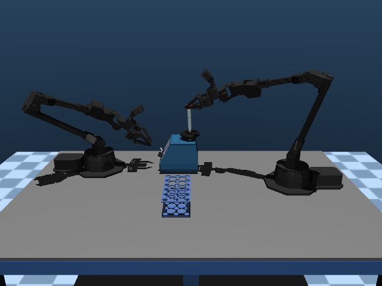
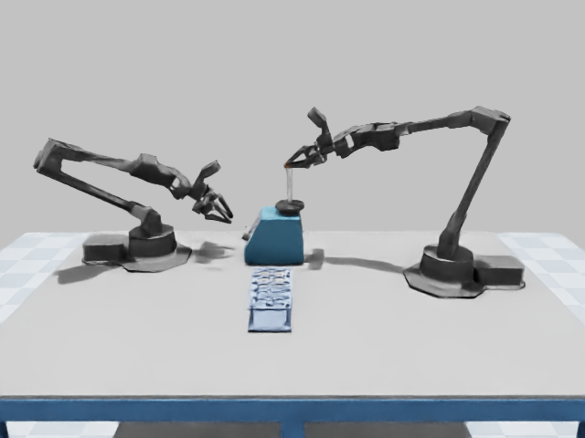
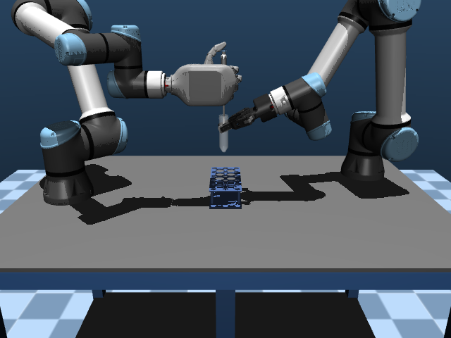
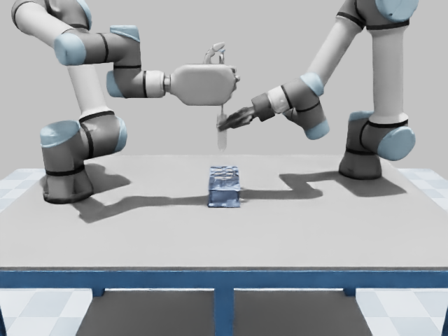

# 双引擎共享控制与移液体积模型

## 最新验收结果

2026-09-16，各批次使用冻结版本和独立输出目录。动作验收读取真实控制、接触及终态；理想体积 v2 读取实际活塞行程，并独立反算液面几何体积。

| 任务 | MuJoCo 动作 / 时限内 | Isaac 动作 / 时限内 | 理想体积 v2：MuJoCo / Isaac | 冻结代码：MuJoCo / Isaac |
| --- | ---: | ---: | ---: | --- |
| 原子插管，种子 0–9 | 10/10 | 10/10 | — | `79bc811` / `65b447e` |
| 复合入口的插入步骤，种子 0–9 | 10/10 | 10/10 | — | `79bc811` / `65b447e` |
| 涡旋，源种子 0–9；原生种子 0 | 10/10 | 1/1 | — | `c353a27` / `c353a27` |
| 温和抬起移液，种子 0–9 | 10/10 | 10/10 | 10/10 / 10/10 | `94cdb8f` / `94cdb8f` |

移液新动作保留 30 秒任务时限、1 nL 体积误差和环境储量阈值。Isaac 首批旧动作的严格体积验收为 7/10，失败种子 4、6、8 均在新版正式回归中通过。单独的新版 seed 4 试验与正式回归是两次真实执行，物理轨迹各字段及类型逐项相等。

| 新版移液指标，10 个专家回合 | MuJoCo | Isaac |
| --- | ---: | ---: |
| 仿真时长 | 14.406–15.438 秒 | 14.402–15.440 秒 |
| 完整回合实际耗时 | 24.904–26.709 秒 | 192.072–202.974 秒 |
| 吸头终量 | 200 µL | 199.999649–199.999933 µL |
| 环境终量 | 0 nL | 0.066952–0.350568 nL |
| 最大液面几何误差 | 0.998431–0.999984 nL | 0.998835–0.999970 nL |
| 最大总体积守恒误差 | 5.421e-20 m³ | 8.132e-20 m³ |

本轮多阶段共完成 60 个 MuJoCo 空动作回合和 3 个 Isaac 空动作回合，动作及体积验收均未误通过。源对照各运行 30 秒；Isaac 移液对照两个种子各运行 30 秒，涡旋对照一个种子仅运行 2 秒。

涡旋与移液的旧任务谓词仍报告 `TASK_FAILED`，独立动作及理想体积验收通过；两种结论分别保留。默认 Isaac 涡旋仍需约 40 分钟完成一个回合，且只验证一个种子。`parity_qualified=false`、`scientific_process_validated=false`；未取得动力学、像素或科学过程等价性认证。165 个目录条目和 22 个源专家的全量结果仍是此前记录的历史基线。

本轮共保存 190 条逐回合记录：143 条 MuJoCo、47 条 Isaac，包含旧候选、空动作与诊断。189 个回合完成，另一个凸近似诊断因 600 秒实际预算终止；900 秒预算复测完成但归位失败。详见 [可随分支保存的完整指标与哈希](validation/isaac_shared_processes_summary.json)。61 项单元测试通过。

以下记录实现、失败及修正边界。上一轮基线见 [流程验收报告](isaac_process_manipulation.md)。

## 真实关键帧与显示同步

提交 `28d5e4b` 修正原生相机的 RGB 缓冲延迟：运动几何和纹理更新后均等待 8 个渲染帧，再读取 RGB。修改只位于 `NativeScene.render_frame`；物理步进、重置、观测及转换方法的 AST 与 `94cdb8f` 分别相等。完整动作回归仍使用表中各自的冻结版本。

原生实际步进对照覆盖涡旋和移液，各自使用相同记录执行器目标，分别执行有、无渲染的 100 个物理步。有渲染模式每 20 步出一帧；两种模式的 `qpos`、`qvel` 和时间数组逐字段及类型完全相等，出图前后的物理时间和步数不变。该探针共 400 个实际物理步，验证显示不会改变这段运动；不作为完整专家或科学过程验收。

下图分别由两个引擎恢复实际记录的关节状态与液面日志后渲染。Isaac 关键帧回放一次出图调用等待 8 个渲染帧后读取 RGB，物理时间和步数保持不变，未增加初始化物理步。相同阶段的记录时间可能不同；图像不是新闭环回合，也未取得像素等价性认证。[图片、轨迹、液面和源快照哈希](validation/isaac_shared_keyframes.json) 随分支保存，局域网图库另提供前视和腕部相机共 24 张图。

| 阶段 | MuJoCo | Isaac |
| --- | --- | --- |
| 涡旋旋转接触 |  |  |
| 移液吸液后 |  |  |

## 已完成的 MuJoCo 正式回归

2026-09-16，固定种子 0–9。首批运行代码冻结于 `79bc811`；后续 `b8bff48` 仅补充错误路径处理，证据核对工具另行加入。

| 任务 | 动作 / 时限内通过 | 仿真时长 / 秒 | 理想体积验收 |
| --- | ---: | ---: | ---: |
| 原子插管 | 10/10 | 12.384–13.370 | — |
| 复合入口的插入步骤 | 10/10 | 12.384–13.370 | — |
| 涡旋 | 10/10 | 29.192–29.318 | — |
| 移液 / 体积状态 v1 | 10/10 | 13.786–14.800 | 10/10 |

涡旋保留 30 秒时限，终态归位误差为 0.489–0.969 mm；10 个回合未检测到两臂接触。移液吸头终量为 200 µL，源容器的体积状态与记账一致。涡旋和移液各 10 个、持续 30 秒的空动作对照均未误通过。

原子及复合插管共 20 个回合的 `qpos`、`qvel`、控制量和时间数组与上一轮逐字段相等，验证原有笛卡尔轨迹行为保留。该比较针对同一后端的版本回归，不要求两种引擎积分后的轨迹相同。Isaac 原生回归单独记录。

进一步对全部液面日志的法向与高度反算几何体积时，v1 的 10 个移液回合最大偏差为 55.475–55.649 µL，终态偏差为 31.228–32.666 µL：容器缓存体积检查不能验证液面几何。共享液面更新增加按体积误差收敛的牛顿修正与区间保护，v2 验收独立反算液面体积。旧 v1 结果按原有范围保留，不能算作液面几何验收通过。

修正代码冻结于 `c353a27`，正式复测共 41 回合：涡旋与移液分别包含 10 个专家回合、10 个持续 30 秒的空动作对照，另加原子插管 seed 0。

| 液面修正后的复测 | 动作 / 时限内通过 | 理想体积 v2 | 最大液面几何误差 |
| --- | ---: | ---: | ---: |
| 涡旋专家 | 10/10 | — | — |
| 涡旋空动作 | 0/10 | — | — |
| 移液专家 | 10/10 | 10/10 | 0.998431–0.999984 nL |
| 移液空动作 | 0/10 | 0/10 | — |
| 原子插管兼容复测 | 1/1 | — | — |

10 个移液专家回合的吸头终量均为 200 µL，仿真时长仍为 13.786–14.800 秒。20 个涡旋回合和插管兼容回合的物理轨迹数组与修正前分别逐字段相等，支持液面几何修正未改变这些机械动作。

移液专家会读取测得的液面高度计算下降目标，因此其控制和物理状态数组随液面精度修正发生微小变化；10 个回合的第一臂最大控制差为 `4.617e-8–5.206e-6 rad`，时间数组相等。10 个移液空动作对照的全部轨迹字段保持相等。正式 v2 验收使用修正后的实际回合，不把旧专家轨迹当作相等证据。

## 原生移液失败与释放动作修正

液面几何 v2 的原生移液十种子回归动作与时限验收 10/10，严格体积验收 7/10；seed 4、6、8 因排液进入环境失败。seed 4 有 0.884 µL 排入环境。保存的实际按钮轨迹在抬起阶段出现 7 次向外活塞行程，其累计量与环境储量相等；该失败保留，不放宽 1 nL 环境储量阈值。

提交 `cebbcfb` 将共享释放动作的拇指目标从原先结束时的 0.4 rad 改为平滑伸展到 0.2 rad，增加按钮间隙。释放时长、机器人规划限制、任务时限和体积模型均保留，不加入引擎分支。修正后的 MuJoCo seed 4 动作及严格体积验收通过，仿真时长仍为 13.786 秒；61 项单元测试通过。完整双引擎复测另行记录。

进一步几何审计发现，漏液时拇指与按钮已有约 5.7 mm 间隙；达到 0.2 rad 目标时，几何间隙约为 13.7 mm。这是静态几何比较，不能证明漏液由拇指接触造成。按钮及其子部件总质量约为 3.673 g，限位处弹簧力为 0.04 N，对应加速度尺度为 10.890 m/s²。根据实际记录速度和源空间运动学反算，首个主要漏液行程发生时工具沿按钮轴加速度为 13.712 m/s²，支持惯性压下按钮的解释，尚不构成两引擎受力等价性证明。

提交 `94cdb8f` 增加独立的抬起规划器，关节速度及加速度限值均为 0.5，其余动作继续使用原规划器。路径执行函数接受可选规划器，便于按阶段配置动作限值；体积模型、资产和引擎接口不变。温和抬起的 MuJoCo seed 4 动作与严格体积验收通过，仿真时长为 14.406 秒，原 30 秒时限保留。61 项单元测试通过，正式双引擎复测单独记录。

冻结于 `94cdb8f` 的正式 MuJoCo 复测完成种子 0–9，共 20 回合：专家动作和时限验收 10/10，严格体积 v2 验收 10/10，吸头终量均为 200 µL，环境储量均为零。仿真时长 14.406–15.438 秒，最大液面几何误差 0.998431–0.999984 nL。10 个持续 30 秒的空动作对照未误通过，其物理轨迹字段、类型与修正前逐字段相等。源试验的输入文件字节指纹与冻结正式批次一致。

同一冻结版本的 Isaac seed 4 完整试验动作及严格体积验收通过，仿真用时 14.402 秒。环境排液量从旧动作的 0.884 µL 降至 0.297 nL，低于原有 1 nL 阈值，吸头终量为 199.999703 µL。记录的抬起区间沿按钮轴峰值加速度降至 7.873 m/s²；与排液量下降相符。该试验为单个种子；随后独立执行的原生十种子回归动作、时限与严格体积验收均为 10/10，完整范围见本页开头。

## 已完成的 Isaac 插管扩展回归

原生运行代码冻结于 `65b447e`，原子入口及复合入口各完成种子 0–9。两个入口均为动作与 15 秒时限内通过 10/10；复合入口在本批只执行插入步骤。

| 指标 | 两个入口的范围 |
| --- | ---: |
| 仿真时长 | 12.368–13.390 秒 |
| 插入目标距离 | 1.693–1.830 mm |
| 轴线倾角误差 | 0.010897–0.026276 rad |
| 连续稳定时间 | 1.576–2.504 秒 |
| 完整回合实际耗时 | 209.505–223.308 秒 |

同一种子下，两个入口的 `qpos`、`qvel`、控制量、时间和接触数组均逐字段相等。每个种子的源快照均核对 412 个数值字段、109 个实际复制资产文件及其哈希，和对应 MuJoCo 输入一致。这里验证的是共享输入及同一后端的配方复用；动力学等价性仍未验收。

## 两臂协作

`control_streams.run_control_streams` 接收多个动作生成器。生成器每次产生一个执行器编号到目标值的映射，空映射表示保持当前目标。调度器合并目标后只推进一次物理仿真，使两臂使用同一个时钟。

一个执行器在一次调度中只属于一个动作流；跨时刻交替写入也会报错。所有目标必须有限且编号有效，验证完成后才写入控制数组。异常退出时关闭动作流。

涡旋任务利用该调度器重叠执行抓取与调档、停机与归位。两臂依然通过执行器和真实接触操纵试管、旋钮及开关。放置和归位使用当前测得的抓取变换；归位只对齐试管轴，保留旋转对称试管自由的轴向角度。

抬高后的转移使用关节轨迹，避免笛卡尔路径在腕部奇异位形附近产生过大的关节绕行。新增 `Topp.joint_traj` 使用分段恒加速度参数化；原有笛卡尔轨迹继续使用原来的样条参数化。两臂的关节速度和加速度限制仍为 0.8，任务声明时限仍为 30 秒。

控制流程要求实际开关与请求档位到位、试管与旋转平台连续接触达到混匀时长，以及最终开关回到关闭位置。独立动作验收读取实际仿真状态；实际混匀效果与物理等价性需要另外验证。

## 移液体积

体积统一使用立方米：`200 µL = 200e-9 m³`。三个层次的职责分别是：

| 模块 | 职责 |
| --- | --- |
| `liquid_transfer` | 不依赖引擎的体积状态、容量限制、守恒记账和理想活塞模型 |
| `pipetting.PipetteTransferSystem` | 读取实际按钮关节行程和容器几何，判断浸入状态及排液目的地 |
| `backends.volume_assessment` | 独立报告目标吸液量、守恒、容量及源容器液面对应的体积 |

按钮按下比例增大时排液，比例减小时吸液。仅当吸液时吸头实际处于容器内部且低于液面，才从该容器转移体积。空中释放记录为空气行程；空中排液进入环境储量。转移量受供液量及接收容量限制。错误不会消耗尚未成功处理的按钮行程。

吸头容量取自场景中的 `tip_200ul` 标称容量。现有专家场景包含一个源容器，因此整机回合验证的是吸液并抬起。共享系统可通过 `destinations` 配置多个接收容器；向空接收容器排液已通过几何集成测试，完整机器人双容器转移配方仍待实现。

`ContainerSystem.set_volume` 更新体积和液面位置，不额外推进物理时间或液面动力学。液体日志同时记录是否存在液体及体积，两个回放渲染器据此显示空容器。液面高度按实际截面体积求解，避免小活塞行程落入原编译求解器的粗容差。

## 验证解释

动作验收使用 `hooke-manipulation-v3`；理想体积验收使用 `hooke-ideal-volume-v2`，在网页和矩阵中分别显示。空动作对照应在两类验收中均失败。矩阵保留错误、超时和失败种子，未记录回合仍属于计划分母。

体积验收要求吸头终量距标称容量不超过 5%、最大总体积误差、源容器体积状态误差及独立反算的液面几何体积误差不超过 `1e-12 m³`、储量满足容量边界、没有液体排入环境。这些是理想模型的记账条件，不能作为真实移液器精度指标。模型未模拟压力、气体压缩性、气泡、滴落、残液、倾倒溢出或流量标定，液量变化也未反馈到容器质量与惯性。

源任务的涡旋 `check()` 仍是恒假占位；移液旧谓词具有历史流程语义。因此独立验收通过的专家回合仍可能报告 `TASK_FAILED`，结果保留两种结论。复合离心机目录入口的当前回归范围仍是插入步骤，后续关盖、锁盖、启动和安全结束需单独验收。

`parity_qualified=false` 和 `scientific_process_validated=false` 继续保留。相同源资产和配方、成功动作以及理想体积守恒，都不等于两种引擎的动力学与科学过程已经等价。

## 原生性能诊断范围

共享涡旋配方在 Isaac 默认碰撞配置完成 seed 0：动作和 30 秒时限内通过 1/1，仿真用时 29.294 秒，归位误差 0.830 mm，终态倾角 0.016621 rad，两臂接触时间为零。实际档位到达 3、开关到达开启位置，连续旋转接触完成 1 秒混匀阶段，最后开关关闭并归位。旧 `check()` 占位仍报告 `TASK_FAILED`，独立验收全部通过。

该默认回合实际耗时 2397.459 秒，其中原生物理步耗时 1975.476 秒；运行速度仍与 MuJoCo 有明显差距。本项只有一个种子，不能扩展为所有涡旋种子或性能等价性结论。

相同复位状态的 100 步短探针中，物理线程数 1、4、8 的实际耗时分别为 11.870、11.834、11.790 秒，没有观察到明显收益。另一个静态探针中，圆柱凸近似使 100 步耗时从 11.893 秒降至 1.582 秒，但接触数也从 429 变为 373。静态探针不能证明完整操作流程加速或碰撞行为等价。

NVIDIA 文档提供圆柱凸近似作为性能选项，并说明部分自定义几何及 SDF 接触路径会回到 CPU 处理。结合本地耗时分布，这是一条待核实的性能原因；当前证据不能定位到具体内核。[圆柱碰撞设置](https://docs.omniverse.nvidia.com/kit/docs/omni_physics/107.3/dev_guide/rigid_bodies_articulations/collision.html)、[PhysX GPU 刚体限制](https://nvidia-omniverse.github.io/PhysX/physx/5.5.0/docs/GPURigidBodies.html)。前者文档版本高于本机 `omni.physx 106.5.7`，仅作为机制参考。

默认圆柱碰撞设置保留。完整涡旋回合的凸近似运行单列为 seed 0 诊断，按实际动作、终态和耗时记录结果，不计入默认配置的验收通过数。

首个完整配方的凸近似诊断在 600 秒实际耗时预算内推进到最后记录的 28.2 秒仿真时间，随后被预算终止，记录为 `WALL_TIMEOUT`，未取得完整回合验收。保留原结果，另设新输出目录以 900 秒实际预算复测；原有 30 秒任务声明时限和动作约束均保留。实际预算延长不代表原失败回合通过。

900 秒预算的独立复测完成了 29.254 秒仿真，实际耗时 619.705 秒，其中物理步耗时 288.767 秒。虽然比默认单回合更快，试管归位距离为 56.517 mm、终态倾角为 1.541620 rad（约 88.3°），`returned_within_30mm` 验收失败。混匀接触、释放和停机通过，不能据此判定完整任务通过。该配置不计入默认验收，也不替换默认圆柱碰撞；需要对抓握及放回支撑接触另行定位，当前证据不能证明具体哪对接触造成归位失败。

## 运行

从 `Hooke/` 源码目录使用已配置的 Python：

```bash
python -m unittest discover -s ../tests -v
python -m backends.matrix --task vortex_mixer --backend mujoco \
  --mode expert --mode no_action --control-seconds 30 \
  --output ../temp/backend_parity/vortex_shared_recheck
python -m backends.matrix --task pipette --backend isaac \
  --mode expert --wall-seconds 600 \
  --output ../temp/backend_parity/pipette_volume_recheck
```

每次复测使用新的输出目录。矩阵会记录代码、资产及 Isaac 环境选项指纹；恢复运行仅接受相同输入和参数。`HOOKE_ISAAC_SIMULATION_THREADS` 是可选的原生线程诊断设置，默认仍为 1，不代表已取得任务加速效果。

保存后的证据可通过独立命令核对，无需启动 Isaac：

```bash
python -m backends.evidence source /path/to/mujoco/source /path/to/isaac/source
python -m backends.evidence trajectory /path/to/baseline/trajectory.npz /path/to/new/trajectory.npz
```

源快照核对全部数值字段、数据类型、名称、导出 XML、资产清单及实际复制文件的 SHA-256；轨迹核对字段完整性和数组。差异使命令以非零状态退出。证据一致仍不构成物理等价性认证。
