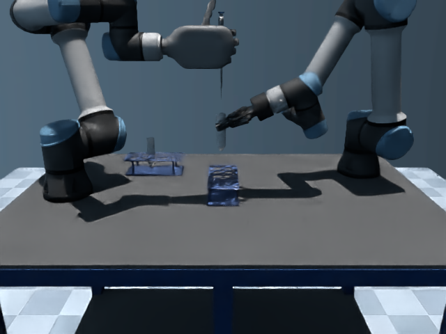

# 原资产显示配置与实际图像对照

网页 Native 默认使用 `source_display`，命令行默认保留 `physical`。前者重用原天空纹理，转换为原生 dome 的 latlong 图，并对材质颜色做 sRGB 转换、使用线性色调映射。它不生成替代资产，也不改变物理、碰撞、原相机位姿或 FOV。

| 实测项 | 原生材质配置 | 源显示颜色配置 |
| --- | ---: | ---: |
| 真实配对画面 | 9 组 | 同 9 个阶段/相机组合 |
| 平均 RGB 绝对误差 / 255 | 92.153 | 34.684 |
| 误差下降 | — | 62.4% |

[图像哈希与逐张误差](validation/isaac_source_display_visual_difference.json) 保留实际记录终态、回放来源和参数。图像中既有两引擎终态的几何差异，也有渲染差异；此指标不能单独解释为 shader 误差。透明度、金属反射、阴影和细节仍有差异，尚未通过逐像素等价，也没有认证整个场景库的材质响应。

局域网实际对照：[源显示颜色画廊](http://10.5.174.93:8081/source-display-gallery.html)。三个相机、三个阶段，共 18 张真实图片，按相机切换。

物理计数修正：旧移液回放报告只检查运行器计数，不能据此宣称 Kit 内部初始化完全没有步进。新增独立 PhysX 回调的 [离心机关键帧](validation/isaac_cycle_isaac_keyframes.json) 记录内部初始化 2 步、随后恢复记录状态；恢复后的各次渲染实际推进 0 个物理事件，姿态校验通过。内部初始化、回合执行和恢复后渲染分别报告。

| MuJoCo：吸液完成 | Isaac：同阶段记录终态 |
| --- | --- |
|  |  |

两边默认输出 640×480、20 FPS，可通过共同的渲染环境变量配置。科学模型网页实验为 1 FPS。原生太阳与环境光强可单独配置；所有实际设置写入结果和关键帧报告。单卡网页依次执行两个后端，分别保留结果用于并排回看，避免争用服务器 GPU。
